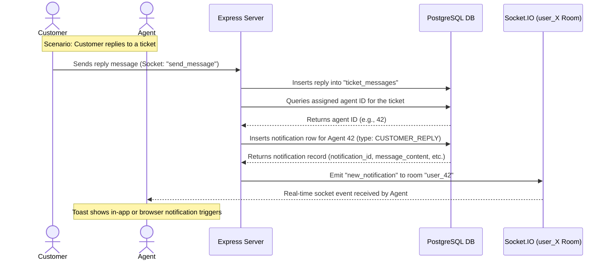

# SupportIQ: Real-Time Notification System Guide

This guide explains the architecture, database integration, server logic, and frontend components of the real-time notification system in SupportIQ.

---

## 1. Architectural Blueprint & Data Flow

Below is the workflow of how notifications are triggered, saved, and dispatched in real-time to the correct users:



### The 4 Notification Events
1. **`CUSTOMER_REPLY`**: Customer replies to an open ticket $\rightarrow$ Notifies the assigned agent.
2. **`AGENT_REPLY`**: Agent replies to a ticket $\rightarrow$ Notifies the customer.
3. **`TICKET_RESOLVED`**: Agent marks a ticket as resolved $\rightarrow$ Notifies the customer.
4. **`TICKET_REOPENED`**: Customer replies to a resolved ticket $\rightarrow$ Automatically reopens ticket and notifies the agent.

---

## 2. Database Layer
All notifications are stored in the `Notifications` table. 

### Schema structure
* `notification_id`: Primary key.
* `user_id`: Foreign key pointing to the recipient (can be an Agent or a Customer).
* `ticket_id`: Associated ticket.
* `notification_type`: String (one of the 4 events above, plus `TICKET_ASSIGNED`).
* `message_content`: User-friendly text displayed in notifications.
* `is_read`: Boolean (defaults to `false`).
* `created_at`: Timestamp.

---

## 3. Backend (Server) Implementation

### A. Personal Rooms: The Socket.IO Connection Strategy
To push real-time notifications to a user no matter what page they are viewing, each user joins a personal socket room unique to their ID upon authentication.

#### [server.js](file:///d:/CCE/WebDev_Course/supportiq/server/server.js#L27-L49)
1. **Handshake Verification**: When a client establishes a socket connection, the server decodes their JWT token, extracting the `customer_id` (used as the primary user ID for both customer and agent roles).
2. **Joining the Room**: The socket is subscribed to a room called `user_<userId>` (e.g., `user_42`).

```javascript
io.on("connection", (socket) => {
    console.log("Client connected : ", socket.id);

    // Join a personal room so we can push notifications regardless of page
    const userId = socket.user.customer_id;
    socket.join(`user_${userId}`);
    console.log(`User ${userId} joined personal room user_${userId}`);
    
    // ...
});
```

### B. Message Events & DB Triggers
Inside the socket handler, the logic branches based on whether the sender is an **Agent** or a **Customer**.

#### [server.js](file:///d:/CCE/WebDev_Course/supportiq/server/server.js#L69-L134)
* **If Sender is Agent (`AGENT_REPLY`):**
  1. Retrieves the owner of the ticket (`customer_id`).
  2. Inserts an `AGENT_REPLY` notification.
  3. Targets the customer's personal room using `io.to("user_" + customerId).emit("new_notification", ...)`.
* **If Sender is Customer (`CUSTOMER_REPLY` & `TICKET_REOPENED`):**
  1. Finds the `assigned_agent_id`.
  2. Inserts a `CUSTOMER_REPLY` notification and emits to `io.to("user_" + agentId)`.
  3. If the ticket status was `'Resolved'`, it updates the status back to `'Open'`. It inserts a secondary notification for the agent (`TICKET_REOPENED`) and emits to the agent's room, while also emitting `ticket_reopened` to the ticket room so the agent's chat screen updates live.

```javascript
if (sender === "Agent") {
    // 1. Get customer
    const custResult = await pool.query(`SELECT customer_id FROM tickets WHERE ticket_id = $1`, [ticket_id]);
    const customerId = custResult.rows[0]?.customer_id;
    if (customerId) {
        // 2. Write to DB
        const notiResult = await pool.query(
            `INSERT INTO Notifications (user_id, ticket_id, notification_type, message_content)
             VALUES($1,$2,'AGENT_REPLY', $3) RETURNING *`,
            [customerId, ticket_id, `Agent replied to your Ticket #${ticket_id}`]
        );
        // 3. Socket emit
        io.to(`user_${customerId}`).emit("new_notification", notiResult.rows[0]);
    }
} else {
    // Get agent
    const agentResult = await pool.query(`SELECT assigned_agent_id FROM tickets WHERE ticket_id = $1`, [ticket_id]);
    const agentId = agentResult.rows[0]?.assigned_agent_id;
    if (agentId) {
        const notiResult = await pool.query(
            `INSERT INTO Notifications (user_id, ticket_id, notification_type, message_content)
             VALUES($1,$2,'CUSTOMER_REPLY', $3) RETURNING *`,
            [agentId, ticket_id, `Customer messaged to Ticket #${ticket_id}`]
        );
        io.to(`user_${agentId}`).emit("new_notification", notiResult.rows[0]);
    }
    
    // Auto-reopening checks ...
}
```

### C. HTTP REST Endpoints
For actions performed via standard web actions, the server accesses the `io` instance through Express variables.

#### [agent.js](file:///d:/CCE/WebDev_Course/supportiq/server/routes/agent.js#L112-L143)
When an agent resolves a ticket:
1. It updates the status to `Resolved` in the DB.
2. It fetches the `customer_id`.
3. It inserts a `TICKET_RESOLVED` notification.
4. It calls `req.app.get("io")` to fetch the global Socket.IO instance and emits:
   * `new_notification` to `user_${customerId}` (updating the customer's badge and displaying a toast).
   * `ticket_resolved` to the main ticket room (updating the active customer chat screen in real-time).

```javascript
const io = req.app.get("io");
if (io) {
    io.to(`user_${customerId}`).emit("new_notification", notiResult.rows[0]);
    io.to(id).emit("ticket_resolved");
}
```

### D. Sharing Service Logic
To avoid copying the notification listing, filtering, and mark-as-read code for the customer side, the same router is mounted twice in `server.js`:
```javascript
app.use("/", notiRoutes);       // Customers hit /noti, /noti/filter, etc.
app.use("/agent", notiRoutes);  // Agents hit /agent/noti, /agent/noti/filter, etc.
```
Since the `verifyToken` middleware populates `req.customer_id` with the active user's ID, [NotiService.js](file:///d:/CCE/WebDev_Course/supportiq/server/services/NotiService.js) automatically filters database actions based on the current user.

---

## 4. Frontend Client Implementation

### A. The Toast Listener (`NotificationToast.jsx`)
This component is the heart of the frontend notification experience. It is mounted once globally in the navbars so that it runs persistently across all pages.

#### 1. Lazy Socket Connections
The listener checks the status of the connection. If the user is logged in but the socket is not active, it attaches the JWT token to `socket.auth` and calls `socket.connect()` automatically:
```javascript
if (!socket.connected) {
    socket.auth = { token: localStorage.getItem("token") };
    socket.connect();
}
```

#### 2. Dual Delivery Mechanism: Visibility API
When a `new_notification` event arrives:
* **Scenario A: Tab is Visible**
  The component appends the notification to the `toasts` array. This triggers a React state update, rendering an animated glassmorphic popup in the bottom-right corner.
* **Scenario B: Tab is in the Background (Hidden)**
  If the user is browsing another website or has the app minimized, it falls back to the browser's native **HTML5 Notification API** to slide out a system-level popup.

```javascript
if (document.visibilityState === "visible") {
    setToasts((prev) => [{ ...noti, id, exiting: false }, ...prev]);
} else {
    if ("Notification" in window && Notification.permission === "granted") {
        const browserNoti = new Notification("SupportIQ", {
            body: noti.message_content,
            icon: "/favicon.ico",
            tag: `supportiq-${id}`,
        });
        browserNoti.onclick = () => {
            window.focus();
            // Redirect to ticket page ...
        };
    }
}
```

#### 3. Automatic Dismissal & Transitions
* **Timers**: A `useEffect` hook monitors the `toasts` array. For each active toast, it triggers a `setTimeout` that calls `dismiss(id)` after **5 seconds** (`AUTO_DISMISS_MS = 5000`).
* **Visual Progress Bar**: Under the hood, CSS animations decrease the width of a status bar at the bottom of the toast from $100\%$ to $0\%$ over 5 seconds.
* **Smoother Transitions**: When a toast is dismissed, `exiting: true` is set, applying the `.toast-exit` transition class (translating it offscreen). It is removed from the DOM $350\text{ms}$ later.

---

### B. Navbar Badge Updates
Both [TicketNavbar.jsx](file:///d:/CCE/WebDev_Course/supportiq/frontend/src/components/TicketNavbar.jsx) and [AgentNavbar.jsx](file:///d:/CCE/WebDev_Course/supportiq/frontend/src/pages/agent/AgentNavbar.jsx) utilize the `onUnreadChange` prop of the `<NotificationToast />` component.

```javascript
// Inside Navbar components
const [unread, setUnread] = useState(0);

// Passed to Toast component
<NotificationToast onUnreadChange={setUnread} />
```

Whenever a new notification is pushed via Socket.IO, `NotificationToast` intercepts the event, displays the alert, and executes:
```javascript
if (onUnreadChange) onUnreadChange((prev) => prev + 1);
```
This instantly increments the red counter badge next to the "Notifications" link in the navigation header without requiring manual polling or page loads.

---

### C. Customer Notifications Page (`CustNoti.jsx`)
This component behaves exactly like the agent's notification view but requests routes on the customer-level namespace.
* Fetches the list of notifications on mount (`/noti/filter`).
* Allows toggle filtering between `Unread` and `Read` states.
* Includes a "Mark all as Read" bulk-update button.
* Resolves types like `AGENT_REPLY` and `TICKET_RESOLVED` into distinct emojis and labels.
